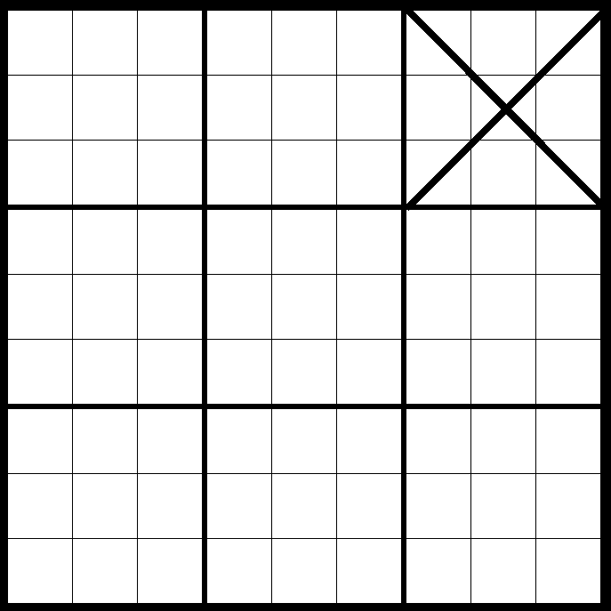
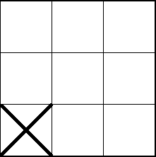
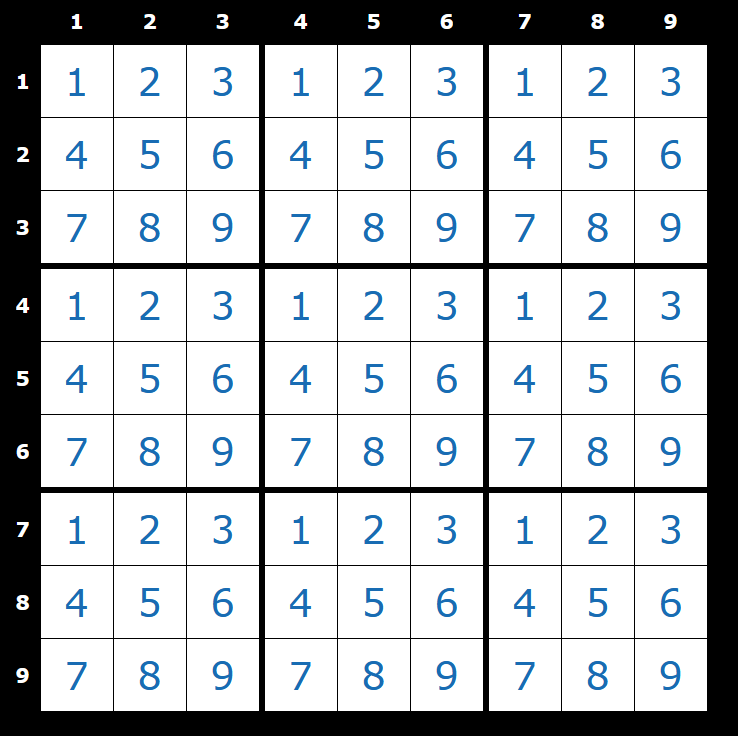

# SudokuBoard

## Description 

SudokuBoard is a (Windows only) AutoHotKey script designed for improving the computer sudoku experiance. It allows you to quickly and comfortably navigate the sudoku board, enter numbers, and delete them. What makes SudokuBoard truly useful is its ability to let you navigate to any cell with two key presses. With access to a Numpad, you can even comfortably solve sudoku puzzles one-handed.

Here's how it works:
The script creates three layers you can easily swap between, `Entry`, `Navigation`, and `Set-Coordinates`. Each layer allows you to use the WASD/arrow keys to navigate the sudoku grid as you might expect, including wrapping around when reaching the start or end of a row or column. Additionally, each layer has additional features.

In the `Entry` layer you can use the Numpad or the 3x3 UIO/JKL/MCommaPeriod block of keys to enter numbers into the puzzle, granting a Numpad-like functionality to those who don't have a full sized keyboard.

The `Navigation` layer lets you identify a specific cell to auto-navigate to with the Numpad or that 3x3 block. The first key press will send you to one of the larger 9 'boxes' while the second sends you to a cell within that box. The keys match up to the region you want to navigate to. For example, pressing the top-left key of the Numpad or 3x3 block will send you to the top-left box, and then pressing the bottom-right key will send you to the bottom-right cell of that box. 

This allows almost instant navigation across the grid without ever moving your hands off the keyboard.

Finally, the `Set-Coordinates` layer lets you tell the program which cell you start the puzzle with selected so it can keep track of your position.

SudokuBoard also features two modes, a Cursor Mode and a Mouse Mode. Why? 

Because not all sudoku programs/sites are created equally. Some don't let you use your arrow keys to navigate between cells, while others are inconsistent about how many presses of an arrow key it takes to get from one side of the grid to the other.

Mouse Mode lets you bypass these issues by calibrating the mouse for a specific puzzle, and then letting you manipulate the mouse with the usual keyboard controls. When you use mouse mode, you can use SudokuBoard even on sites that have inconsistent interfaces.

That's just the basics, the rest of this file contains a more thorough explanation of how to use SudokuBoard. Don't be intimidated if you can't remember everything right away, or some parts don't make sense! Just work with what you do understand, and it will all click together. Once you get the hang of it you'll see how SudokuBoard is a much better way of solving sudoku puzzles.

If you want to focus on just the important parts for now, you can skip sections like [Configuration](#configuration) and let SudokuBoard run on its default settings until your ready to read more. 

However, be sure to read [Installation](#installation) and [Usage](#usage), plus anything about mouse mode if you end up using it. That's the bare minimum info you need to use SudokuBoard effectively. 

--- 
## Table of Contents


* [Installation](#installation)
* [Configuration](#configuration)
    * [Settings](#settings)
    * [Mouse Calibration](#mouse-calibration)
* [Usage](#usage)
    * [Controls](#controls)
    * [Navigation](#navigation)
    * [Mouse Mode](#mouse-mode)
    * [Web Sudoku Pencil Marks](#web-sudoku-pencil-marks)
* [Features](#features)
    * [Coordinate Systems](#coordinate-systems)
    * [Mouse Mode](#mouse-mode)
* [Contributing](#contributing)
* [License](#license)


--- 
## Installation

To use this program, you must first install AutoHotKey V2, which [you can do here](https://www.autohotkey.com/v2/). This is the program that allows SudokuBoard to run.

Then you can download this script using the green 'Code' button, selecting 'Download as Zip', and extracting the resulting files from the downloaded zipped folder. 

With AHK installed you can run the script by double clicking `SudokuBoard.ahk`.

--- 
## Configuration 

SudokuBoard has several configuration options to let you customize your experience. These are mostly located and controlled via the `settings.ini` file, but this section also discusses how to calibrate the mouse. If you don't want to mess with the settings for now, feel free to skip the following section, and you can skip the section on mouse calibration too if you don't need it.

### Settings 

The settings here can be edited by opening the `settings.ini` file in Notepad, changing the settings, and saving the file. The changes take place once you start or reload the script.

`tooltipOn`, `xCoordinate`, and `yCoordinate` allow you to set the details of the tooltip that displays the controls, current layer, and whether or not mouse mode is engaged. Setting `tooltipOn` to 0 turns the tooltip off and setting it to 1 turns it back on. The `xCoordinate` and `yCoordinate` settings let you specify where which pixel on the screen the tooltip should appear (so on a 1920x1080 screen, setting those coordinates would have the tooltip appear in the lower right).

`sqrSize` is a setting that, in future iterations, will let you use SudokuBoard for larger and smaller puzzles with dimensions that are perfect squares. Best not to touch it for now.

`webSudokuPencilMarks` is a setting used specifically for the way the site [websudoku.com](#http://www.websudoku.com/) handles their pencil marks. Unless you use this site, you can ignore this setting, otherwise set it to 1 and check out the relevant section under [Usage](#web-sudoku-pencil-marks).

`mouseMode` lets you start the script in Mouse Mode by default. You can of course toggle Mouse Mode while the script is running, but this setting lets you make Mouse Mode the default. 

The next four settings hold the data for the mouse calibration. You can read more about in [Features](#features). The values saved here work for one puzzle in the position you calibrated the mouse in. If you want to recalibrate for a diffrent position or puzzle you can comment out these four values by preceding them with a semicolon, like so:
```
; startPositionX =0
; startPositionY=0
; xOffset =0
; yOffset =0
``` 

Values that are commented out are not visible to the script.

Then you can do another calibration to generate a new set of values, and easily swap between the two by only leaving uncommented the set you wish to use. 

### Mouse Calibration 

Mouse calibration can be triggered by pressing `Control + Alt + Shift + c`, or by right-clicking the tray icon and selecting the appropriate option. Before starting the calibration it's important to arrange your sudoku puzzle on the screen as it would be when solving it. Mouse mode doesn't track the puzzle itself, only its position set when you calibrate, so if you move the puzzle around afterwards (such as scrolling down, changing the zoom level, or shrinking the window) the calibration will be invalid.

Once you begin, instructions for calibration will pop up. Once you read these and close the dialogue box, the next four left clicks/Enter key presses will record the appropriate information.

You'll need to click the top-left corner of the sudoku grid, the top-right corner, the bottom-left corner, and lastly the bottom-right corner, in that order. You can move the mouse, or use the arrow/WASD keys to move the mouse one pixel. It isn't necessary to be pixel-perfect, but you should try to be accurate. If you have issues, you can always recalibrate.

After calibration, you'll have the option to save the calibration, save the calibration but start a new calibration, or discard the data and exit. You can also check a box to save the relevant data as the default (directly to the `settings.ini` file).

--- 
## Usage 

The following three sections detail how exactly to use SudokuBoard. This will cover the keyboard controls, how exactly to use SudokuBoard's navigation method in the best way, and how and why to use the optional mouse mode.

Using SudokuBoard is pretty simple. 

1. First, you open up your sudoku puzzle.
2. Then you start the program by double clicking `SudokuBoard.ahk` or a shortcut.
3. Then you start your puzzle and select a cell, highlighting it or putting your cusor there. 
4. You then press `F` to enter the `Set-Coordinates` layer, and set the coordinates. 
5. Then you can use the keyboard controls to navigate the board with the `Navigation` layer or the arrow/WASD keys, and enter in numbers with the `Entry` layer.

### Controls 

These are the controls that are active in each layer. It's ok if you don't learn all of these right away. Once you get a sense of the pattern, they'll be easy to remember. Just use this section as an introduction and a reference guide.

In each layer, the arrow/WASD keys can be used to move one cell in any direction. However, in both the `Navigation` and `Set-Coordinates` layer, using these single-cell navigation keys will automatically send you back to the `Entry` layer. This is to make it easier to swap between the layers, and make the experiance of using the script at high speed more comfortable. 

Additionally, in each layer you can use the E key to backspace the current cell, though this does not send you back to the `Entry` layer since sometimes you just visit a cell to delete its contents and then move on.

It's also worth going over the specific ways you can enter and exit each layer.

The script starts in `Entry`. From there, pressing either CapsLock or the Numpad Plus will send you to `Navigation`. 

In `Navigation` pressing CapsLock or Numpad Plus will send you back to `Entry`.

From either of these layers you can press F or Numpad 0 to go to the `Set-Coordinates` layer. In `Set-Coordinates`, CapsLock/Numpad Plus will send you to `Navigation` while F/Numpad 0 will send you to `Entry`. However, these last controls will be rarely used, since once coordinates have been successfully set, you'll be sent directly back to `Entry` automatically.

Finally, from any layer you can press `Control + Alt + Shift + Letter` to activate a variety of effects. 

Replacing `Letter` with `Q` will `Q`uit the program. `S` will `S`uspend the program, disabling all the key commands except for these combos (useful if you want to type something using your usual letter keys while the SudokuBoard is active). `C` will start the mouse `C`alibration, and `M` will toggle `M`ouse mode. 

Don't worry if the `Navigation` and `Set-Coordinates` controls don't totally make sense yet, the [Navigation section](#navigation) will explain.

#### Entry 

`w/Up Arrow`: Move up one cell.  
`s/Down Arrow`: Move down one cell.  
`a/Left Arrow`: Move left one cell.   
`d/Right Arrow`: Move right one cell.  

`e/Numpad Slash`: Backspace.   

`u/Numpad 1`: Enter 1.  
`i/Numpad 2`: Enter 2.  
`o/Numpad 3`: Enter 3.  
`j/Numpad 4`: Enter 4.  
`k/Numpad 5`: Enter 5.   
`l/Numpad 6`: Enter 6.  
`m/Numpad 7`: Enter 7.  
`./Numpad 8`: Enter 8.  
`,/Numpad 9`: Enter 9.  

`CapsLock/Numpad +`: Go to `Navigation` layer.  
`f/Numpad 0`: Go to `Set-Coordinates` layer.  

`Control + Alt + Shift + Q`: Quit script.  
`Control + Alt + Shift + S`: Suspend hotkeys.  
`Control + Alt + Shift + M`: Toggle mouse mode.  
`Control + Alt + Shift + C`: Start mouse calibration.  

#### Navigation 

`w/Up Arrow`: Move up one cell, and return to `Entry`.   
`s/Down Arrow`: Move down one cell, and return to `Entry`.  
`a/Left Arrow`: Move left one cell, and return to `Entry`.   
`d/Right Arrow`: Move right one cell, and return to `Entry`.  

`e/Numpad Slash`: Backspace.   

`u/Numpad 7`: Enter top-left.  
`i/Numpad 8`: Enter top-center.   
`o/Numpad 9`: Enter top-right.   
`j/Numpad 4`: Enter middle-left.   
`k/Numpad 5`: Enter middle-center.   
`l/Numpad 6`: Enter middle-right.   
`m/Numpad 1`: Enter bottom-left.  
`./Numpad 2`: Enter bottom-center.   
`,/Numpad 3`: Enter bottom-right.   

`CapsLock/Numpad +`: Go to `Entry` layer.  
`f/Numpad 0`: Go to `Set-Coordinates` layer.  

`Control + Alt + Shift + Q`: Quit script.  
`Control + Alt + Shift + S`: Suspend hotkeys.  
`Control + Alt + Shift + M`: Toggle mouse mode.  
`Control + Alt + Shift + C`: Start mouse calibration.  

#### Set-Coordinates

`w/Up Arrow`: Move up one cell, and return to `Entry`.  
`s/Down Arrow`: Move down one cell, and return to `Entry`.  
`a/Left Arrow`: Move left one cell, and return to `Entry`.   
`d/Right Arrow`: Move right one cell, and return to `Entry`.  

`e/Numpad Slash`: Backspace.   

`u/Numpad 7`: Enter top-left. Second press returns to `Entry`.  
`i/Numpad 8`: Enter top-center. Second press returns to `Entry`.   
`o/Numpad 9`: Enter top-right. Second press returns to `Entry`.  
`j/Numpad 4`: Enter middle-left. Second press returns to `Entry`.  
`k/Numpad 5`: Enter middle-center. Second press returns to `Entry`.  
`l/Numpad 6`: Enter middle-right. Second press returns to `Entry`.  
`m/Numpad 1`: Enter bottom-left. Second press returns to `Entry`.  
`./Numpad 2`: Enter bottom-center. Second press returns to `Entry`.  
`,/Numpad 3`: Enter bottom-right. Second press returns to `Entry`.  

`CapsLock/Numpad +`: Go to `Navigation` layer.  
`f/Numpad 0`: Go to `Entry` layer.  

`Control + Alt + Shift + Q`: Quit script.  
`Control + Alt + Shift + S`: Suspend hotkeys.  
`Control + Alt + Shift + M`: Toggle mouse mode.  
`Control + Alt + Shift + C`: Start mouse calibration.  
  
### Navigation 

Navigation is designed to be easy to learn and deeply intuitive. That said, it might be a little confusing in text. 

A sudoku grid can be divided into 9 larger boxes, each of which contains 9 cells. Coincidentally, both the Numpad and the remapped block of letter keys are also a 3x3 block containing 9 keys.

Thus, any cell in the sudoku grid can be identified by selecting one of the boxes, then one of the cells, using the physical placement of the 3x3 block.

For example, you might press the top-right key (which is O/Numpad 9), and select this box:



And then press the bottom-left key (which is M/Numpad 1) to select this cell within the selected box:



This method is how the navigation layer works, as well as how you set the coordinates when first starting a puzzle. It is critical to set the coordinates before using any of the controls. If the controls are not working as expected, it is likely because the coordinates have not been set properly, or have gotten out of tune. Selecting a cell with the mouse, manually as it were (without using mouse mode), isn't tracked by the program, so if you do that it is important te set the coordinates again.

The final note on navigation is that you need not press both the key to identify the box and the key to identify the cell. Once you press the first of the pair, the program will auto navigate to the box you have selected, at the same cell. So if you have selected the middle-center cell, and move to a new box, the middle-center cell of that box will be selected. You can then choose to select the exact cell you want, or navigate with the WASD/arrow keys. Leaving the `Navigation` layer resets the count, so that on returning your next key press will select the boxes again. 

### Mouse Mode 

Mouse mode is a way to control the mouse using the keyboard. Using the arrow keys or the navigation layer to move around the cursor will, by default, trigger presses of the arrow keys to get you where you need to go. With mouse mode, those same controls will instead move your mouse to the cell you need to select and click on it.

This is why mouse mode requires calibration; the script needs to know exactly where on the screen the puzzle grid is and its dimensions. Calibration is accessible through keyboard shortcuts and the tray icon menu.

If you try to activate mouse mode (via the keyboard shortcut or the tray menu), and you do not have stored calibration data, mouse mode will not activate. Instead, a prompt for calibration will appear. Once calibration has been completed, mouse mode can be properly activated.

Mouse mode is best used for sites that don't let you select every cell, or sometimes require more than one press of the usual arrow keys to cross a cell (looking at you [websudoku.com](http://www.websudoku.com/)).

### Web Sudoku Pencil Marks 

The website [websudoku.com](http://www.websudoku.com/) handles pencil marks (also known as candidate marks) in a non-standard way. It simply allows you to type multiple numbers, up to 5, in a single cell. A cell containing more than one number has the numbers turn green and small. For this site, and any site with a similar method, I have added special detection for pencil marks.

To access this special detection, first allow access to it by setting `webSudokuPencilMarks` to 1 in the `settings.ini` file. 

With this special detection activated, typing multiple numbers in a cell will automatically be detected as pencil marks. This means that, regardless of the order you enter your marks, the numbers will keep themselves sorted, least to greatest. Additionally, trying to enter a number that a cell already contains will delete that number.

For example, you might enter the numbers `1`, `5`, and `3` in that order, resulting in a cell containing `135`. If you then entered `3` again, the cell would change to contain only `15`.

If you wish a cell to contain only a single number, but still have that number be denoted as a pencil mark, simply enter that number, then enter and remove any other number. Your original number will remain with a `.` to make it green and small. The dot automatically removes itself if you add more numbers to the cell.  

When you enter multiple numbers into a cell the script detects that you are entering pencil marks. Subsequently removing all other numbers but one doesn't undo that detection, rather the script assumes you wish to have only a single pencil mark in that cell. Thus, entering `5`, then double tapping any other 'number' key from either the numpad or the 3x3 block results in a cell that contains `5.`.

If you wish to empty a cell of pencil marks you can do so with `E` or `Numpad Slash` as normal. For example, if you decide that that previous cell with the pencil mark `5.` should actually just be `5`, you need only erase the contents with `E` and reenter the appropriate number.

Importantly, if you use this pencil-marks feature, you must also use mouse mode. You need to use mouse mode on websudoku.com anyway, but on other sites the program will not be able to navigate properly in the default mode if you are using this special detection and pencil marks work the way the do on websudoku.com.

--- 
## Features

This section is more for those interested in some of the behind-the-scenes details of how this script works. 

I'll also try to add some of my reasoning for why the script works the way it does here. 

For example, I decided to make layer switching based on a toggle (press to get in, press again to get out), instead of a modifier (hold down to get in, release to get out), because at high speeds toggling is much more reliable and I wanted to reduce errors here more than the benefits of modifiers.

### Coordinate Systems 

There are two coordinate systems that one might use for picking out a particular cell in a sudoku grid. One, as described, is what I call box notation that follows this format: (box, cell). You can assign a number to each box like so:  


And a number to each of the smaller cells like so:  


You could also, as is demonstrated in the photos, use a more traditional cartesian coordinate system. 

So, the box method is very intuitive, and easy to translate to keyboard inputs. But it is very difficult to calculate the cursor key inputs needed to move from one point to another, at least compared to the cartesian coordinate system. In that system, you can simply subtract the old X and Y coordinates from the new ones to get a number whose sign denotes its direction (right vs. left, up vs. down).

My solution to this mismatch, one system easy to use but hard to use for path-finding, and vice versa, was to develop a sysem of equations to translate between the two coordinate systems. Here are those equations below, in the functions I use to translate between them:
```r
cartesianToBox(coordArr){
    x := coordArr[1]
    y := coordArr[2]

    a := Round(Ceil(x/rootSqrSize) + ((Ceil(y/rootSqrSize)-1)*3))
    b := Round((Mod((x-1), rootSqrSize)) + ((Mod((y-1), rootSqrSize)*rootSqrSize)+1))
    Return [a, b]
}

boxToCartesian(coordArr){
    a := coordArr[1]
    b := coordArr[2]

    x := Round((Mod((a-1), rootSqrSize)*3) + (Mod((b-1), rootSqrSize)+1))
    y := Round((a-(Mod((a-1), rootSqrSize))) + (Ceil(b/3)-1))
    Return [x, y]
}
```
Here, `rootSqrSize` is simply the number 3, the square of the size of the grid. `Mod()` is a function which calculates the remainder when you divide the first parameter by the second, and `Ceil()` rounds the parameter it takes up to the next integer as long as the parameter isn't an integer (but a floating point number).

With these functions I can calculate exactly where a person wants to be with box notation, translate it, and generate the outputs. It's also useful to translate back the other way when I want to move to the same cell, but a different box, as when you press a key for the first time in the `Navigation` layer.

### Mouse Mode

Mouse mode works very simply. The calibration picks out the coordinates of the four points of the sudoku grid on one's screen. It uses these points to calculate the average width and height recorded, which are then used to calculate the approximate height and width of each cell. 

Theses values are used as the x and y offset, the number of pixels the mouse needs to move along the x or y axis to move to a new cell. The start position of the mouse is determined by moving 55% down from the top right corner and 80% over to the right. This last part is essential, since the cursor needs to be clicked to the right of whatever number is in the cell for sites that let you move the cursor to the right or left of the number.

--- 
## Contributing

If you'd like to contribute to this repository feel free to fork it/create a pull request. Possible areas of improvement include improving the GUI and tooltip, adding support for 4x4 and 16x16 size puzzle grids, and if you are feeling particularly ambitious, finding a way to rewrite this script for Linux and Mac ecosystems.

Other bug fixes, cleanups, and features are also welcomed.

--- 
## [License](./LICENSE)
This website uses the open-source MIT License.

--- 
